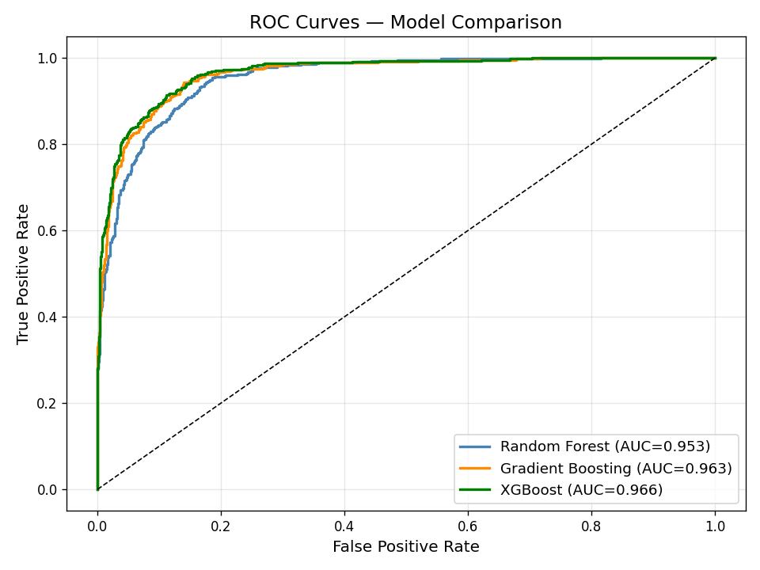
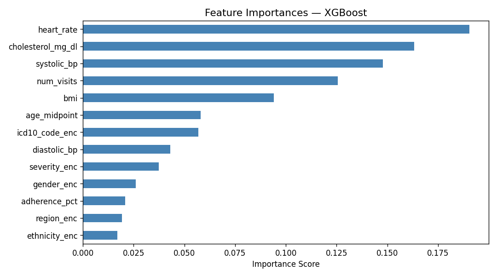
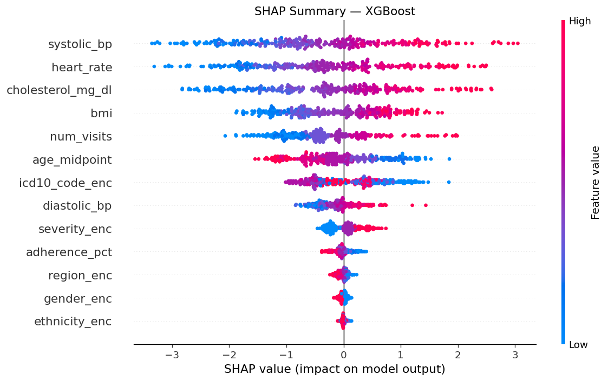
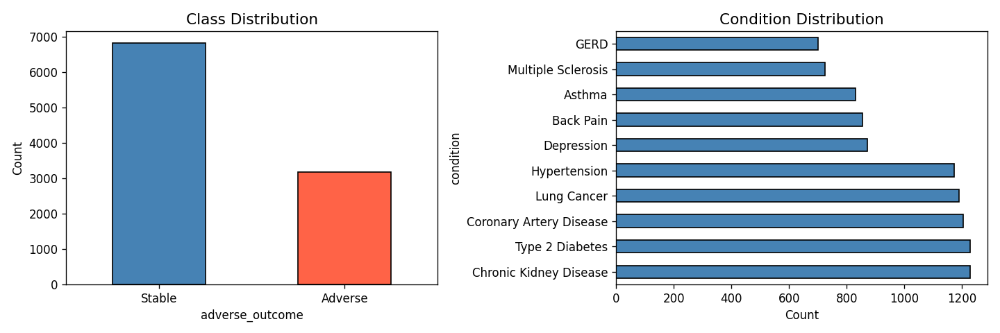
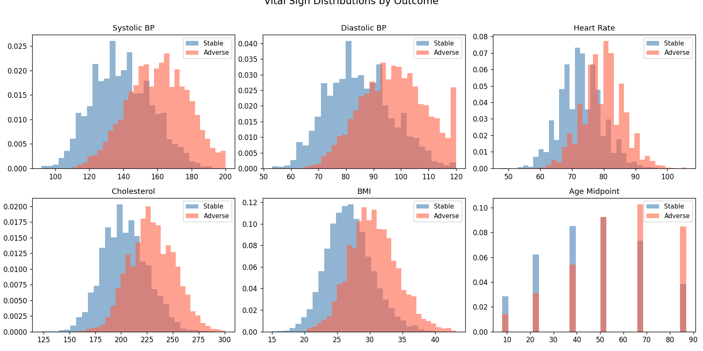

# 🏥 Synthetic Privacy-Preserving Medical EHR Dataset

[](https://creativecommons.org/licenses/by/4.0/)
[](https://www.python.org/)
[](https://doi.org/10.5281/zenodo.18968480)

## 📌 Overview

This repository contains 10,000 fully synthetic Electronic Health Records (EHRs) designed for binary classification research in healthcare AI. The task is predicting adverse patient outcomes — deterioration or death — from demographic, clinical, and vital sign features.

No real patient data was used at any stage. The dataset is fully compliant with GDPR, CCPA, and HIPAA.

---

## 📊 Dataset Stats

| Property | Value |
|---|---|
| Total Records | 10,000 |
| Total Columns | 20 |
| ML Features Used | 13 |
| Target Column | adverse_outcome (0 = Stable, 1 = Adverse) |
| Class Distribution | ~68% Stable / ~32% Adverse |
| Train Split | 7,000 records (70%) |
| Validation Split | 1,500 records (15%) |
| Test Split | 1,500 records (15%) |

---

## 🤖 Model Results

| Model | Val ROC-AUC | Accuracy | Adverse F1 | CV 5-fold |
|---|---|---|---|---|
| Random Forest | 0.9535 | 89% | 0.82 | 0.9707 ± 0.013 |
| Gradient Boosting | 0.9630 | 90% | 0.84 | 0.9760 ± 0.013 |
| **XGBoost (Best)** | **0.9665** | **91%** | **0.85** | **0.9769 ± 0.012** |
| XGBoost (Test Set) | 0.9542 | 90% | 0.85 | — |

---

## 📈 Visualizations

### ROC Curves — All 3 Models


### Feature Importances — XGBoost


### SHAP Summary — XGBoost


### Data Distributions


### Vital Signs by Outcome


---

## 🔒 Privacy Techniques Applied

| Technique | Implementation |
|---|---|
| Anonymization | UUID patient IDs — no real names or SSNs |
| Generalization | Age buckets, region labels instead of cities |
| Differential Privacy | Laplace noise (epsilon=2.0) on all vital signs |
| Data Perturbation | Gaussian jitter on all continuous features |
| No Target Leakage | outcome column excluded from ML features |

---

## 📁 Repository Structure
```
synthetic-medical-ehr-dataset/
│
├── full_dataset.csv          # All 10,000 records
├── train.csv                 # 7,000 training records
├── val.csv                   # 1,500 validation records
├── test.csv                  # 1,500 test records
├── metadata.json             # Pipeline metadata and best params
│
├── synthetic_medical_dataset.ipynb  # Full pipeline notebook
│
├── roc_curves.png            # ROC curve comparison
├── feature_importance.png    # XGBoost feature importances
├── shap_summary.png          # SHAP interpretability plot
├── data_distributions.png   # Class and condition distributions
└── vitals_distributions.png  # Vital signs by outcome
```

---

## 🔧 ML Pipeline
```
Raw Data Generation
    → 5% Missing Value Simulation
    → Median Imputation
    → Label Encoding (categorical features)
    → StandardScaler (numerical features)
    → Train/Val/Test Split (70/15/15 stratified)
    → SMOTE Oversampling (training set only)
    → RandomizedSearchCV (15 iterations, 3-fold CV)
    → Final Model Training (RF + GBM + XGBoost)
    → 5-Fold Cross Validation
    → SHAP Interpretability
    → Evaluation (ROC-AUC, F1, Confusion Matrix)
```

---

## 📋 Column Descriptions

| Column | Type | Description |
|---|---|---|
| patient_id | String | Anonymous UUID-based identifier |
| age_range | Categorical | Age bucket: 0-17, 18-29, 30-44, 45-59, 60-74, 75-99 |
| age_midpoint | Integer | Midpoint of age bucket — ML feature |
| gender | Categorical | Male / Female / Non-binary |
| ethnicity | Categorical | White / Black / Hispanic / Asian / Other |
| region | Categorical | North / South / East / West / Central |
| icd10_code | Categorical | Primary ICD-10 diagnosis code |
| condition | Categorical | Hypertension, Diabetes, Cancer, etc. |
| severity | Categorical | Mild / Moderate / Severe |
| onset_year | Integer | Year of diagnosis |
| medication | Categorical | Primary prescribed medication |
| num_visits | Integer | Number of provider visits |
| adherence_pct | Integer | Treatment adherence 0-100% |
| systolic_bp | Integer | Systolic blood pressure mmHg |
| diastolic_bp | Integer | Diastolic blood pressure mmHg |
| heart_rate | Integer | Heart rate bpm |
| cholesterol_mg_dl | Integer | Total cholesterol mg/dL |
| bmi | Float | Body Mass Index |
| outcome | Categorical | Recovered / Stable / Deteriorated / Deceased |
| adverse_outcome | Binary TARGET | 1 = Adverse, 0 = Stable |

---

## ⚙️ Requirements
```
pip install faker imbalanced-learn shap xgboost scikit-learn pandas numpy matplotlib
```

---

## 🚀 Quick Start
```python
import pandas as pd

# Load dataset
train = pd.read_csv('train.csv')
val   = pd.read_csv('val.csv')
test  = pd.read_csv('test.csv')

# Target column
X_train = train.drop(columns=['adverse_outcome', 'outcome', 'patient_id'])
y_train = train['adverse_outcome']

print(train.shape)
print(train['adverse_outcome'].value_counts())
```

---

## 💡 Use Cases

- Binary classification for healthcare outcome prediction
- Benchmarking tabular ML models without any privacy risk
- Teaching end-to-end ML pipelines with real preprocessing challenges
- Class imbalance research with SMOTE and threshold tuning
- SHAP and LIME model interpretability research
- Fairness and bias analysis across demographic groups
- Differential privacy and privacy-preserving AI experiments

---

## 🌐 Also Available On

| Platform | Link |
|---|---|
| Zenodo (DOI) | https://doi.org/10.5281/zenodo.18968480 |
| Kaggle | https://www.kaggle.com/datasets/mdsajjadullah/synthetic-medical-ehr-dataset-10k |
| Hugging Face | https://huggingface.co/datasets/mdsajjadullah/synthetic-medical-ehr-dataset |

---

## 📜 Citation

If you use this dataset in your research or projects, please cite:

**APA:**
```
Md. Sajjad Ullah (2025). Synthetic Privacy-Preserving Medical EHR Dataset (v5.0). Zenodo. https://doi.org/10.5281/zenodo.18968480
```

**BibTeX:**
```bibtex
@dataset{mdsajjadullah_2025_synthetic_ehr,
  author    = {Md. Sajjad Ullah},
  title     = {Synthetic Privacy-Preserving Medical EHR Dataset},
  year      = {2025},
  publisher = {Zenodo},
  version   = {5.0},
  doi       = {10.5281/zenodo.18968480},
  url       = {https://doi.org/10.5281/zenodo.18968480}
}
```

---

## 📄 License

This dataset is released under the [Creative Commons Attribution 4.0 International License](https://creativecommons.org/licenses/by/4.0/).
You are free to share and adapt for any purpose with appropriate credit.
```

---

